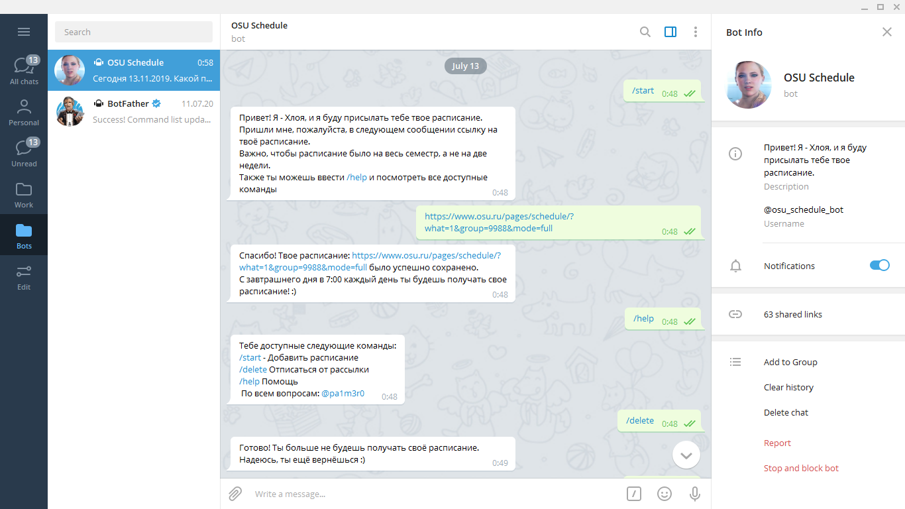
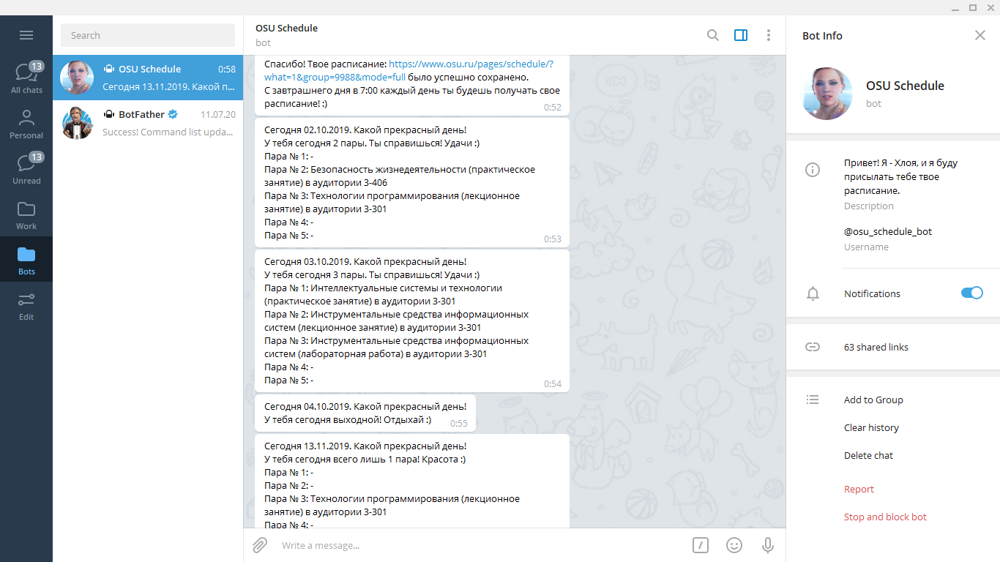

# OSU Schedule bot for Telegram

Телеграм бот для получения расписания с сайта osu.ru

## Адрес бота в Telegram
@osu_schedule_bot

## Доступные команды
| Команда | Описание |
| ------ | ------ |
| /start | Добавить расписание |
| /delete | Отписаться от рассылки |
| /help | Помощь |

## Инструкция по работе
Чтобы начать работу, можно либо ввести команду `/start`, либо сразу отправить боту ссылку на расписание. **Важно, чтобы расписание было на весь семестр, а не на две недели.** После добавления ссылки, бот будет каждый день в 7:00 присылать расписание.
Чтобы отписаться от рассылки, введите команду `/delete`.
Чтобы посмотреть все доступные команды, введите `/help`.

## Пример работы бота

Да-да, бота я назвал Хлоей и поставил её аватарку:) Фанаты Detroit: Become Human - привет)

## Статус бота
На текущий момент Хлоя пока нигде не хостится. Возможно в начале семестра я разверну её у себя на сервере.

## Обратная связь
telegram: @pa1m3r0
